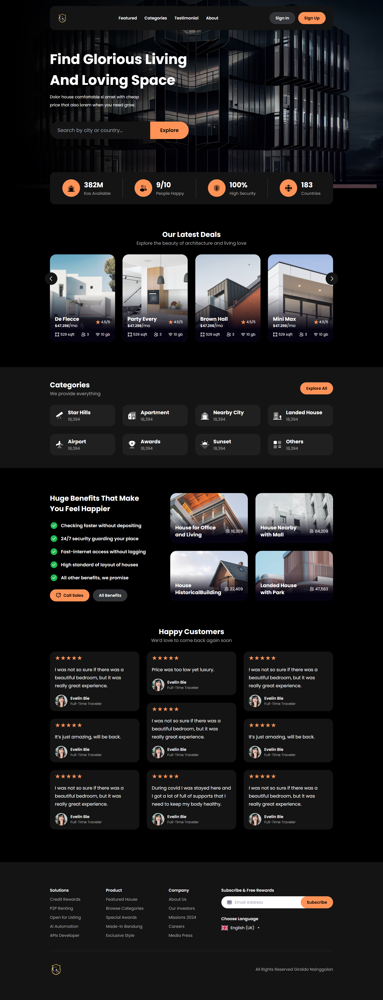

<!--
Hey, thanks for using the awesome-readme-template template.
If you have any enhancements, then fork this project and create a pull request
or just open an issue with the label "enhancement".

Don't forget to give this project a star for additional support ;)
Maybe you can mention me or this repo in the acknowledgements too
-->
<div align="center">

  
  <h1>Awesome Readme Template For Repo</h1>
  
  <p>
    An awesome README template for your projects! 
  </p>
  
  
<!-- Badges -->
<p>
  <a href="https://github.com/GiraldoNainggolan/ClassicPropertyHub/graphs/contributors">
    
  </a>
  <a href="">
    
  </a>
  <a href="https://github.com/GiraldoNainggolan/ClassicPropertyHub/network/members">
    
  </a>
  <a href="https://github.com/GiraldoNainggolan/ClassicPropertyHub/stargazers">
    
  </a>
  <a href="https://github.com/GiraldoNainggolan/ClassicPropertyHub/issues/">
    
  </a>
  <a href="https://github.com/GiraldoNainggolan/ClassicPropertyHub/blob/master/LICENSE">
    
  </a>
</p>
   
<h4>
    <a href="https://github.com/GiraldoNainggolan/ClassicPropertyHub">View Demo</a>
  <span> · </span>
    <a href="https://github.com/GiraldoNainggolan/ClassicPropertyHub">Documentation</a>
  <span> · </span>
    <a href="https://github.com/GiraldoNainggolan/ClassicPropertyHub/issues/">Report Bug</a>
  <span> · </span>
    <a href="https://github.com/GiraldoNainggolan/ClassicPropertyHub/issues/">Request Feature</a>
  </h4>
</div>

<br />

# Investment & Mobility Portal

## Screenshots

### Website Interface



# Installation Instructions
## Clone the Repository:
Clone this repository to your local machine:

```bash
git clone https://github.com/GiraldoNainggolan/ClassicPropertyHub.git
cd yourrepository
```
